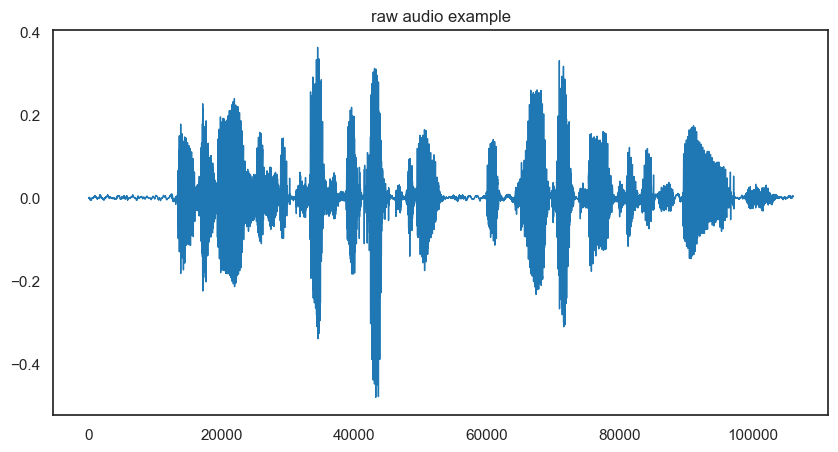
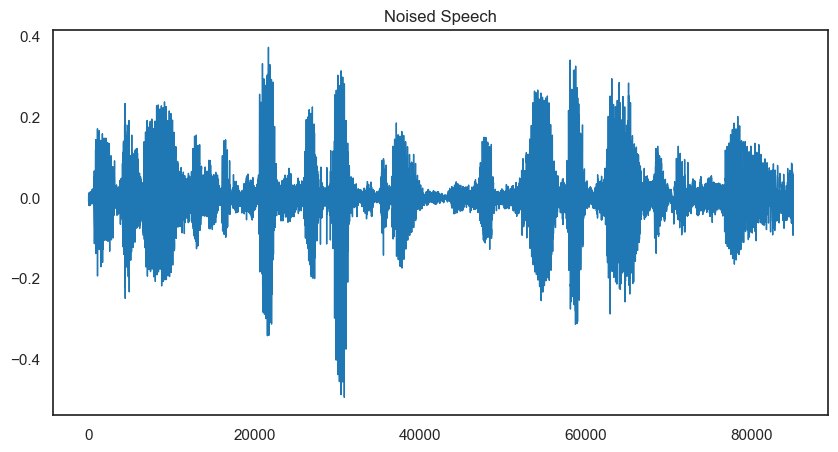
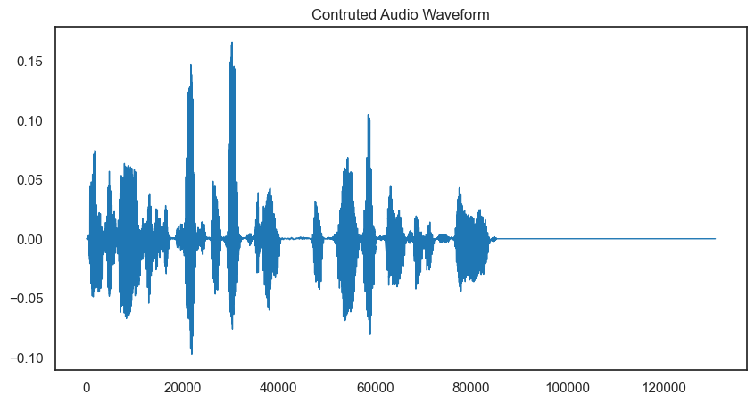
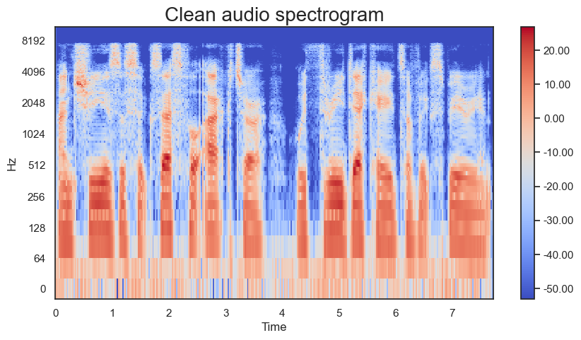
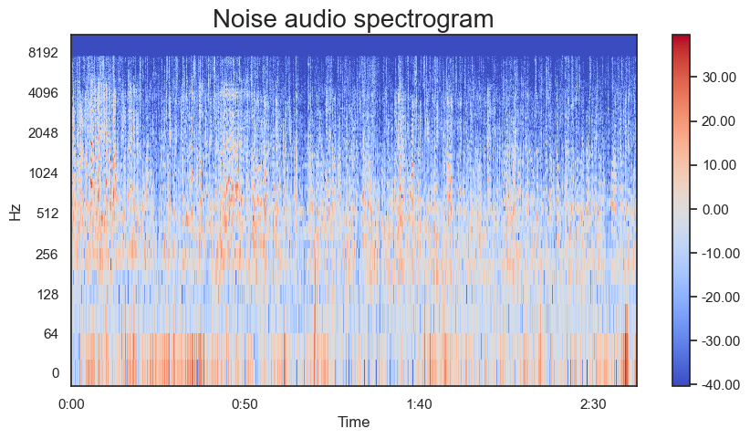
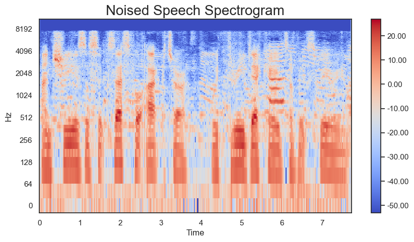
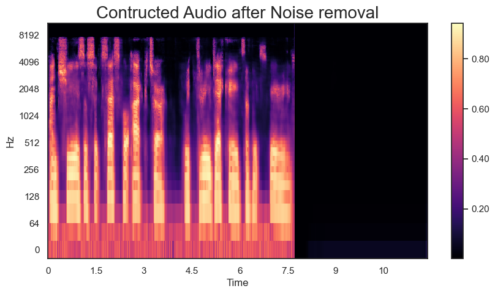

# Speech Denoiser with UNets

## Overview

This repository contains code for a Speech Denoising model based on the UNet architecture. The model is trained on a dataset of 1700 samples, comprising clean and noised audio recordings. The UNet architecture is widely used for image segmentation tasks and has been adapted here for the denoising of audio signals.

## Introduction

Denoising of speech signals is a critical task in various audio processing applications. This repository provides a solution based on the UNet architecture, a convolutional neural network (CNN) commonly used for image segmentation but adapted here for denoising audio.

## Dataset

The dataset consists of 1700 samples, each comprising a clean audio recording and its corresponding noised version. The data was carefully selected to cover a variety of scenarios, ensuring the model's robustness in denoising different types of audio signals.

## Methodology

### Data Preprocessing

The preprocessing steps include loading clean and noise audio files, trimming unnecessary segments, mixing clean audio with random noise audio, and generating log spectrograms of the noisy speech as well as clean audio speech. The noisy speech spectrogram is used as input and clean audio speech is used as desired output for the model. Additionally, the original min-max values of each log spectrogram are saved for later use during denoising.

### Spectrogram Generation
Spectrograms play a crucial role in this denoising project, serving as a key input to the UNet model. A spectrogram is a visual representation of the spectrum of frequencies in a sound signal as they vary with time. In the context of this project, we employ log spectrograms, which offer enhanced sensitivity to audio features.
The process begins by applying the Short-Time Fourier Transform (STFT) to the mixed audio signal. The STFT breaks the audio signal into smaller segments, providing a time-varying representation of the signal's frequency content. The amplitude of each frequency bin is then converted to decibels using the librosa.amplitude_to_db function, resulting in a log spectrogram.

### UNet Architecture

The UNet architecture used in this project comprises downsampling and upsampling blocks. The downsampling block extracts features from the input audio spectrograms, while the upsampling block reconstructs the denoised audio signal spectrograms. Batch normalization and dropout layers are incorporated to enhance model generalization. Skip connections are formed by concatenating the upsampled layer with the corresponding downsampling block's output. This structure enables the model to retain fine-grained details during reconstruction. The final layer of the UNet architecture contains a single filter with a sigmoid activation function. This configuration is suitable for binary classification tasks, making it fitting for the denoising objective. The model outputs denoised log spectrograms.

### Training

Due to memory constraints, the model is trained on a subset of 1700 samples, resulting in potential overfitting. Training on a larger dataset (e.g., 20000 samples) is limited by GPU memory requirements. The model is trained using binary cross-entropy loss, optimizing for the denoised spectrogram output. The intersection over union (IoU) metric is employed to evaluate the model's performance during training.

### Audio Signal Reconstruction

#### Denormalization

During post-processing, the stored min-max values are used to denormalize the denoised log spectrogram.

#### Log Spectrogram to Audio Signal

Inverse log transformation is applied to obtain the amplitude spectrogram. The inverse STFT is then performed to convert the spectrogram back to a time-domain audio signal.

## Results
The audio results is included in the samples folder.

### Waveforms

Below are visualizations of clean audio, noised audio, mixed audio, and noised audio waveforms:

### Spectrograms

Sample spectrograms:

## Limitations

The model has certain limitations:

1. **Overfitting**: The model may exhibit overfitting due to the limited training data (1700 samples).
2. **Memory Constraints**: Training on a larger dataset (e.g., 20000 samples) is restricted by GPU memory requirements.

